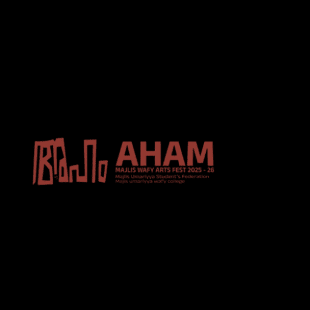

<div align="center">
  
  <h1>AHAM Arts Fest Management System</h1>
  <p><strong>A Real-Time, Serverless Arts Festival Command Center</strong></p>

  [](https://reactjs.org/)
  [](https://firebase.google.com/)
  [](https://vitejs.dev/)
  [](https://web.dev/progressive-web-apps/)
  <br />
  <a href="https://aham-arts-fest.vercel.app"><strong>View Live Demo »</strong></a>
</div>

<br />

## 1. Project Overview
AHAM Arts Fest is a high-performance web application designed to digitize and automate the logistics of a large-scale student arts festival. It serves as a unified hub for real-time event updates, participant tracking, and automated championship scoring, effectively replacing legacy manual spreadsheet workflows and enhancing user engagement.

## 2. Core Technical Features

### ⚡ Real-Time Architecture
*   **Live Leaderboards:** Utilizing Firebase Firestore Snapshot Listeners, the championship standings and team scores update instantaneously across all connected client devices without page reloads as administrators publish new results.
*   **Dynamic Data Syncing:** Event schedules, rolling announcements, and participant matrices are synchronized in real-time, ensuring absolute consistency across the venue.

### 🛡️ Admin & Security Infrastructure
*   **Encrypted Access:** Firebase Authentication layers securely protect the expansive administrative dashboard suites.
*   **Smart Validation & Integrity:** Built-in programmatic safeguards cross-reference incoming result entries against the master participant manifest (parsed natively via `papaparse`) to definitively prevent fraudulent, duplicate, or unverified grade entries.

### 🚀 Performance Optimizations
*   **Progressive Web App (PWA):** Configured via `vite-plugin-pwa` for universal desktop and mobile installability. Critical assets and routes are cached aggressively via Service Workers to guarantee uninterrupted access even in volatile, low-bandwidth festival environments.
*   **Code Splitting:** The implementation of React `lazy` and `Suspense` defers the loading of the heavy administration bundles. This aggressively minimizes the front-door payload, resulting in near-instant load times for the general public interface.

## 3. Local Development

```bash
# 1. Clone the repository
git clone https://github.com/Falcon-Exe/aham-arts-fest.git

# 2. Install core dependencies
cd aham-arts-fest
npm install

# 3. Mount Environment Variables
# Create a .env file locally with your Firebase configuration payload
# VITE_FIREBASE_API_KEY="..."

# 4. Initialize the development instance
npm run dev
```

## 4. System Architecture
*   **Frontend Stack:** React 18, React Router v6, optimized vanilla CSS definitions.
*   **Build & Optimization:** Vite for instantaneous Hot Module Replacement, Vercel Analytics for live user telemetry.
*   **Backend & Data Layer:** Firebase (Firestore NoSQL Database). Complex local UI synchronization is managed via heavily customized React Hooks.

## 📝 Comprehensive Case Study
For deep technical insights, the challenges navigated, and data normalization strategies implemented during development, please review the detailed [Architectural Case Study](./CASE_STUDY.md).
